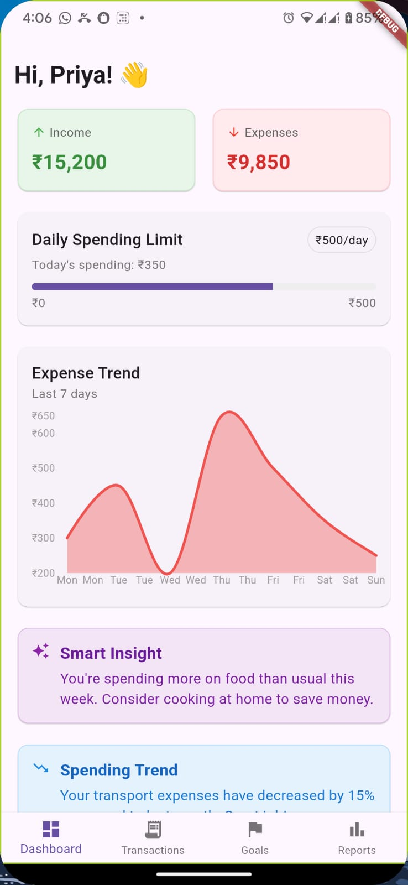
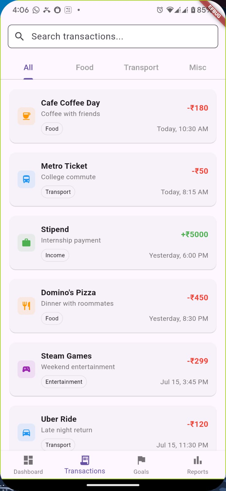

# 💰 Byte Tracker - Envisage 2025 | Personal Finance Assistant for Students

Team Name: Byte Bandits

Problem Statement: Students with limited income often struggle to track expenses, overspend, and fail to save. A smart personal finance assistant is needed to help manage budgets, set goals, and provide spending insights and alerts.

### Backends 
**Bank Simulation Backend:** https://github.com/RitochitGhosh/bytetracker_bank

**App Backend:** https://github.com/RitochitGhosh/bytetracker_

## Overview
The Personal Finance Assistant is a smart solution designed to help students take control of their finances with ease. This intuitive platform offers features like expense tracking, budget planning, goal setting, and spending insights. By simplifying money management, it empowers users to make informed financial decisions, avoid overspending, and build healthy saving habits—all within a student-friendly interface.

## ScreenShots

## 🚀 Features
💰 Budget Tracking: Monitor income and expenses with easy credit and debit entry management.

🎯 Goal Setting: Set custom savings goals (e.g., save ₹10K by Aug ‘25) with notifications upon reaching targets.

📊 Visual Expense Charts: Track and analyze spending trends using clean, interactive area charts.

📈 Weekly Reports: Stay informed with automatically generated summaries of weekly financial activity.

## 📈 **Future Enhancements**

⚠️ **Over-Spending Alerts:** Get reminders when daily spending exceeds your set limits.

🧠 **Smart Insights:** Leverage AI-powered recommendations to improve financial habits and save more.

🌍 **Cross-Platform Integration:** Expand the app to sync with other financial management tools and platforms.

📊 **Advanced Analytics:** Add detailed reports and visualizations for deeper insights into spending habits and savings progress.

🔒 **Enhanced Security:** Implement additional layers of security for sensitive financial data and transactions.

🏷️ **Category Management:** Addition/Edit/Archive of categories

🤖 **AI-Powered Recommendations:** Integrate more advanced AI features for personalized money-saving strategies based on user behavior.

## 👥 Team Members
- Suraj Maharaj (Team Lead)
- Anshu Kumar Singh
- Ritochit Ghosh
- Tamojit Mandal
